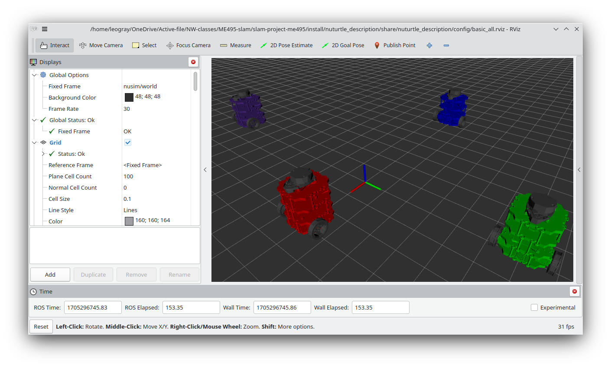

#ME495 Sensing, Navigation and Machine Learning For Robotics
* Leo Chen
* Winter 2024
#Package List
This repository consists of several ROS packages
- nuturtle_description - robot description for turtle bot

#Nuturtle Description
URDF files for Nuturtle tube
* `ros2 launch nuturtle_description load_one.launch.py` to see the robot in rviz.
* `ros2 launch nuturtle_description load_all.launch.xml` to see four copies of the robot in rviz.

* The rqt_graph when all four robots are visualized (Nodes Only, Hide Debug) is:


#Launch File Details
* `ros2 launch nuturtle_description load_all.launch.xml -s`
    ```
    Arguments (pass arguments as '<name>:=<value>'):

        'use_jsp':
            select weather joint state publisher should be used, true or false. default true
            (default: 'true')

        'use_rviz':
            select weather to use rviz, true or false. default true
            (default: 'true')

        'color':
            select the color of the turtlebot. Valid choices are: ['red', 'green', 'blue', 'purple']
            (default: 'purple')
    ```

* `launch nuturtle_description load_one.launch.py -s`
    ```
    Arguments (pass arguments as '<name>:=<value>'):

    'use_jsp':
        select weather joint state publisher should be used, true or false. default true
        (default: 'true')

    'use_rviz':
        select weather to use rviz, true or false. default true
        (default: 'true')

    'color':
        select the color of the turtlebot. Valid choices are: ['red', 'green', 'blue', 'purple']
        (default: 'purple')
    ```