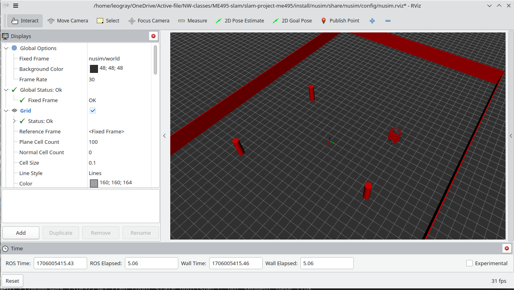

# NuSim

Simulation node for turtlebot.

* `ros2 launch nusim nusim.launch.xml` to launch simulation as well as rviz vitalization.

View of rviz when the simulation is launched with obstacle and arena.


## Launch File

This package provide one launch file:
* `ros2 launch nusim nusim.launch.xml`

```
Arguments (pass arguments as '<name>:=<value>'):

    'config_file':
        Parameter Config file for nusim, default at $(find-pkg-share nusim)/config/basic_world.yaml
        (default: FindPackageShare(pkg='nusim') + '/config/basic_world.yaml')
```

note: There are additional argument available which are inherited from the included launch files. Those should not be used.

## Executable

`nusim` is the only executable in this package. It publish TF to the red turtlebot, publish arena and obstacle information 

```
ros2 node info /nusim
/nusim
  Publishers:
    /nusim/obstacles: visualization_msgs/msg/MarkerArray
    /nusim/timestep: std_msgs/msg/UInt64
    /nusim/walls: visualization_msgs/msg/MarkerArray
    /parameter_events: rcl_interfaces/msg/ParameterEvent
    /tf: tf2_msgs/msg/TFMessage
  Service Servers:
    /nusim/reset: std_srvs/srv/Empty
    /nusim/teleport: nusim/srv/Teleport
```

nusim allows for parameters to change simulation:

* rate: int - frequency of simulation timer updates (hz)
* x0: double - Initial x position
* y0: double - Initial y position
* theta0: double - Initial theta position
* arena_x_length: double - x length of arena
* arena_y_length: double - y length of arena
* obstacles/x: vector<double> - List of obstical's x coordinates
* obstacles/y: vector<double> - List of obstical's y coordinates
* obstacles/r: double - obstacle's radius, all obstacle share this radius 
