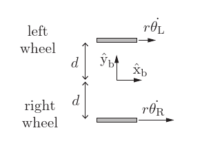

# Diff Drive kinematics

## Assumptions

We assume a diff drive robot is described as following:

* Have only 2 drive wheel (other supporting wheels are not modeled and considered as perfectly frictionless. )
* Two drive wheels are in parallel, drive direction line-up with front of robot.
* Body frame centered between two wheels. Body Frame x axis points to front of robot (and drive direction of wheel)

_Figure 1: image showing diff drive robot wheel and frame layout_

Each diff drive robot's kinematic is characteristic by the two parameters
* wheel track to body width (variable d in image above) 
* wheel radius 

## Source of the math

Most of the math are taken from ___Lynch, Park Modern Robotics___ Chapter 13

## Common Kinematics equation

We define the jacobian between wheel velocity and body velocity as $H(\phi)$

Each wheel occupies one row as 
$$
h_i(\phi)= {1\over {r_i cos(\gamma)}}
\begin{bmatrix}
x_i sin(\beta_i + \gamma_i) - y_i cos(\beta_i + \gamma_i) & cos(\beta_i + \gamma_i + \phi) & sin(\beta_i + \gamma_i + \phi)
 \end{bmatrix}
$$
_equation 1_

which $\gamma_i$ is ith wheel's sliding direction and $\beta_i$ is ith wheel's driving direction

Specifically for diff drive robot, This matrix is: 

$$
H(\phi) = 
\begin{bmatrix}
 -d/r & {cos(\phi)}/r & {sin(\phi)}/r \\
  d/r & {cos(\phi)}/r & {sin(\phi)}/r
 \end{bmatrix} \\
$$
<!-- \begin{bmatrix}
 -1/(2d) & {cos(\phi)}/2 & {sin(\phi)}/2 \\
  1/(2d) & {cos(\phi)}/2 & {sin(\phi)}/2
 \end{bmatrix} \\ -->
_equation 2_
$$
 H(0) =
\begin{bmatrix}
 -d/r & 1/r & 0 \\
  d/r & 1/r & 0
 \end{bmatrix}
$$
_equation 3_

where $r$ is wheel radius and $d$ is body to wheel distance (as in figure 1 above)

## Forward Kinematics

This is the math to go from wheel velocity to body displacement.

### Get the body twist

From Modern Robotics chapter 13.4 equation 13.34

$$
\mathcal{V}_b = H(0) u
$$
_equation 4_

Which evaluate to 
$$ 
\mathcal{V}_b\omega = -1/(2d)  u_L + 1/(2d) u_R\\
\mathcal{V}_bx = {1\over2} u_L + {1\over2} u_R  \\
\mathcal{V}_by = 0
$$
_equation 5_

### Integrate twist

Updating of body configuration is done using twist integration and frame transformation. 

We integrate the body twist $\mathcal{V}_b$ into $T_{bb'}$ using center of rotation trick.

The equations are given in the class notes: 
https://nu-msr.github.io/navigation_site/lectures/odometry.html

The center of rotation (CoR) frame {s} from body frame {b} is found using:
$$
s_x =\mathcal{V}_by / \mathcal{V}_b\omega \\
s_y = \mathcal{V}_bx / \mathcal{V}_b\omega
$$
_equation 6_

Then we rotate frame {s} by amount of twist to get frame {s'}

Finally, we transform the inverse amount of $T_{bs}$ to get frame {b'}

The overall transformation stackup is 
$$
T_{bb'} = T_{bs} T_{ss'} T_{s'b'}
$$
_equation 7_

## Inverse Transformation

The problem here is to go from command twist to desire wheel velocity. 

This is basically the inverse of the equation above.

From Modern robotics Chapter 13.2 Equation 13.8

$$
u= H(0)\mathcal{V}_b
$$
_equation 8_

Which expands to 

$$
u_L = -d/r* \mathcal{V}_b\omega +\mathcal{V}_bx/r \\
u_R =d/r* \mathcal{V}_b\omega +  \mathcal{V}_bx/r \\
$$
_equation 9_

